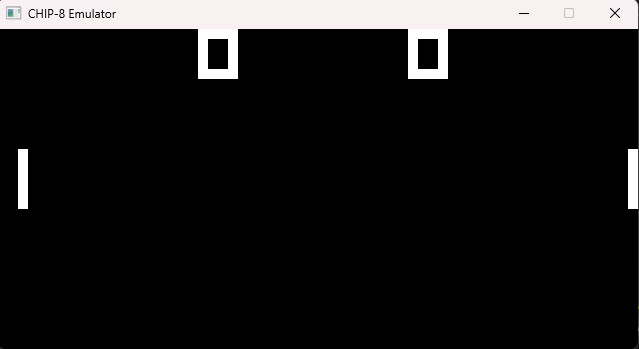

# CHIP-8 Emulator

A CHIP-8 emulator written in Zig with SDL2.


😂

## Features

- Full CPU emulation (all 35 opcodes)
- 64×32 display at 10x scale
- 16-key hex keypad input

## Building

```bash
zig build
```

## Running

```bash
zig build run -- path/to/rom.ch8
```

Or directly:

```bash
./zig-out/bin/console-emulator path/to/rom.ch8
```

## Controls

| Keyboard | CHIP-8  |
| -------- | ------- |
| 1 2 3 4  | 1 2 3 C |
| Q W E R  | 4 5 6 D |
| A S D F  | 7 8 9 E |
| Z X C V  | A 0 B F |
| ESC      | Quit    |

## Test ROMs Included

- `roms/test_opcode.ch8` - Opcode test
- `roms/pong.ch8` - Classic Pong game

## Architecture

```
CPU → Bus → Memory (4KB)
 ↓
Display (64×32)
 ↓
SDL2 Renderer
```

All memory access goes through the Bus abstraction.

## Requirements

- Zig 0.15+
- SDL2 (auto-fetched via zig build)

## License

MIT
